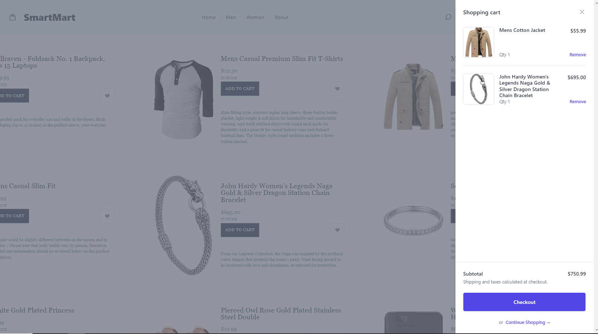
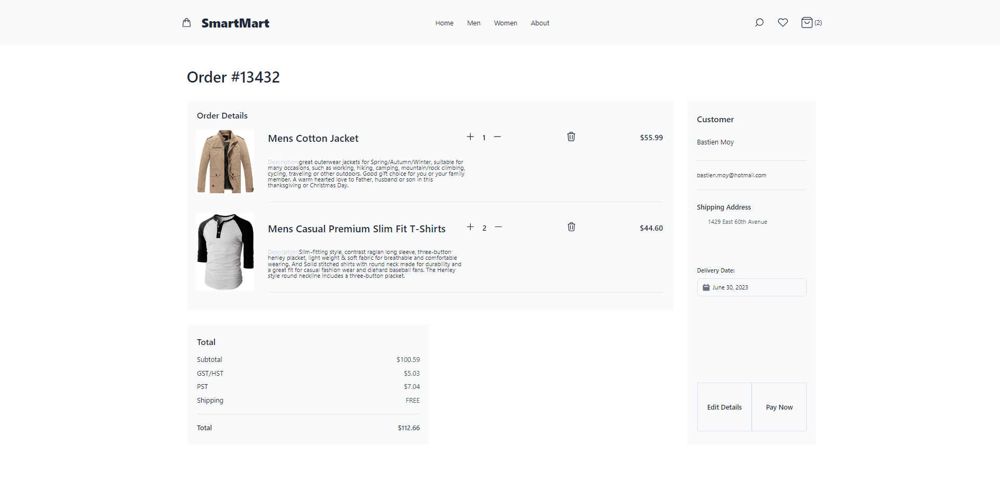
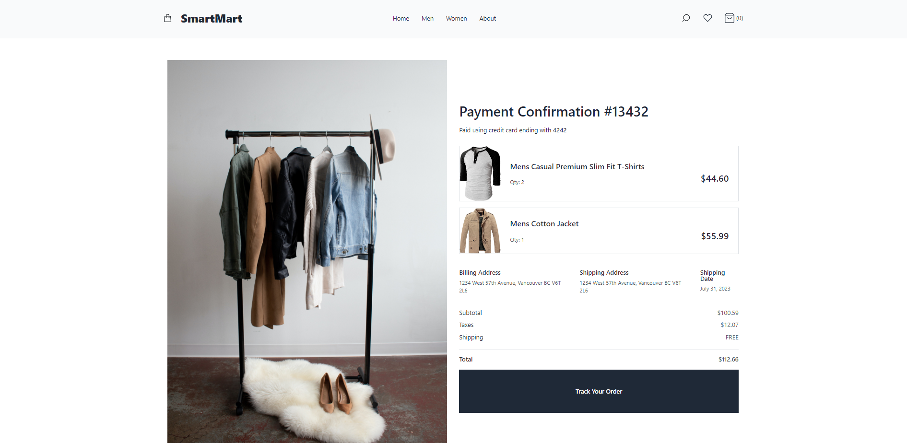

# SmartMart

## Introduction
SmartMart is an ecommerce site with an advanced search feature incorporating AI. With minimalist design created with Tailwind CSS, the site is simple to navigate and has robust functionality. The search feature incorporates AlogoliaSearch API and GPT-3.5-Turbo to attempt to analysis natural language and suggest relevant products.

This app was created by Bastien Moy, and Zhihao Qiu as a final project for the Lighthouse Labs Web Development bootcamp.

## Getting Started

1. Create the `.env` in backend by using `.env.example` as a reference: `cp .env.example .env`
2. Install dependencies: `npm i`
3. Start as Single App:

```
npm install
npm run build
npm start
```

## Dependencies
- Node 15.x or above
- React 18.x or above
- React Router
- Tailwind CSS
- AlgoliaSearch
- Stripe

## Screenshots

### Home page


### Product List


### Cart Modal


### Order Details


### Payment Confirmation

